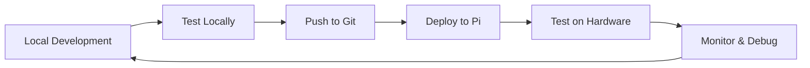

# Artframe Development & Deployment Guide

## Development Workflow Overview



## 1. Local Development Setup

### Initial Setup (One Time)

```bash
# Clone the repository
git clone <your-repo-url>
cd artframe

# Run development setup
./scripts/install_dev.sh

# Activate virtual environment
source venv/bin/activate

# Create your local config
cp .env.example .env
# Edit .env with your test API keys
```

### Development Cycle

```bash
# Always work in virtual environment
source venv/bin/activate

# Make your changes
code .

# Run local tests
python examples/simple_test.py

# Test with mock display
python -m artframe.main --config config/artframe-dev.yaml update

# Run unit tests
pytest tests/unit/ -v

# Format code
black src/ tests/

# Type check
mypy src/artframe --ignore-missing-imports
```

## 2. Deployment to Raspberry Pi

### Method 1: Direct Git Deployment (Recommended for Development)

#### On Raspberry Pi - Initial Setup

```bash
# SSH into your Pi
ssh pi@<your-pi-ip>

# Install git and dependencies
sudo apt-get update
sudo apt-get install -y git python3-pip python3-venv

# Clone your repository
cd ~
git clone <your-repo-url>
cd artframe

# Run the setup script (without sudo first for testing)
python3 -m venv venv
source venv/bin/activate
pip install -r requirements.txt
pip install -e .

# Create test configuration
cp config/artframe-dev.yaml config/artframe-test.yaml
nano config/artframe-test.yaml
# Edit to use mock driver initially, then switch to spectra6
```

#### Deployment Updates

```bash
# On your local machine - push changes
git add .
git commit -m "Your changes"
git push origin main

# On Raspberry Pi - pull and test
ssh pi@<your-pi-ip>
cd ~/artframe
git pull origin main
source venv/bin/activate
pip install -r requirements.txt  # If dependencies changed

# Test the update
python -m artframe.main --config config/artframe-test.yaml test
python -m artframe.main --config config/artframe-test.yaml update
```

### Method 2: Rsync Deployment (Faster for Iterative Testing)

Create a deployment script on your local machine:

```bash
#!/bin/bash
# deploy.sh
PI_HOST="pi@192.168.1.100"  # Replace with your Pi's IP
PI_DIR="/home/pi/artframe"

echo "🚀 Deploying to Raspberry Pi..."

# Sync code files (excluding venv and cache)
rsync -avz --delete \
    --exclude 'venv/' \
    --exclude '__pycache__/' \
    --exclude '*.pyc' \
    --exclude '.git/' \
    --exclude '/tmp/' \
    --exclude 'logs/' \
    ./ $PI_HOST:$PI_DIR/

echo "✅ Deployment complete!"

# Optional: Restart service if running
ssh $PI_HOST "sudo systemctl restart artframe 2>/dev/null || true"
```

Make it executable and use:
```bash
chmod +x deploy.sh
./deploy.sh
```

### Method 3: Development Docker Container (Consistent Environment)

```dockerfile
# Dockerfile.dev
FROM python:3.9-slim

WORKDIR /app

# Install system dependencies
RUN apt-get update && apt-get install -y \
    gcc \
    libjpeg-dev \
    zlib1g-dev \
    && rm -rf /var/lib/apt/lists/*

COPY requirements.txt .
RUN pip install -r requirements.txt

COPY . .
RUN pip install -e .

CMD ["python", "-m", "artframe.main", "--config", "config/artframe-dev.yaml"]
```

Build and run:
```bash
docker build -f Dockerfile.dev -t artframe:dev .
docker run -it --rm \
    -v $(pwd):/app \
    -e IMMICH_API_KEY=$IMMICH_API_KEY \
    -e NANOBANANA_API_KEY=$NANOBANANA_API_KEY \
    artframe:dev
```

## 3. Testing Strategy on Raspberry Pi

### Progressive Testing Approach

#### Stage 1: Mock Display Testing
```yaml
# config/artframe-stage1.yaml
artframe:
  display:
    driver: "mock"  # Start with mock driver
    config:
      width: 600
      height: 448
      save_images: true
      output_dir: "/home/pi/artframe_output"
```

Test:
```bash
# Test basic functionality without hardware
python -m artframe.main --config config/artframe-stage1.yaml test
python -m artframe.main --config config/artframe-stage1.yaml update

# Check saved images
ls -la /home/pi/artframe_output/
```

#### Stage 2: Hardware Display Testing
```yaml
# config/artframe-stage2.yaml
artframe:
  display:
    driver: "spectra6"  # Real hardware
    config:
      gpio_pins:
        busy: 24
        reset: 17
        dc: 25
        cs: 8
```

Test:
```bash
# Enable SPI first
sudo raspi-config
# Interface Options -> SPI -> Enable

# Test display
sudo python -m artframe.main --config config/artframe-stage2.yaml clear
sudo python -m artframe.main --config config/artframe-stage2.yaml update
```

#### Stage 3: Full Integration Testing
Use production config with real API keys:
```bash
export IMMICH_API_KEY="your-real-key"
export NANOBANANA_API_KEY="your-real-key"

python -m artframe.main --config config/artframe.yaml test
python -m artframe.main --config config/artframe.yaml update
```

## 4. Debugging on Raspberry Pi

### Enable Debug Logging

```bash
# Run with debug logging
python -m artframe.main \
    --config config/artframe-test.yaml \
    --log-level DEBUG \
    --log-file debug.log \
    run

# Watch logs in real-time
tail -f debug.log
```

### Common Issues and Solutions

#### GPIO Permission Issues
```bash
# Add user to gpio group
sudo usermod -a -G gpio,spi pi
# Logout and login again

# Or run with sudo (not recommended for development)
sudo python -m artframe.main --config config/artframe.yaml update
```

#### SPI Not Working
```bash
# Check if SPI is enabled
ls /dev/spi*
# Should show: /dev/spidev0.0  /dev/spidev0.1

# Enable SPI
sudo raspi-config nonint do_spi 0
sudo reboot
```

#### Display Not Responding
```python
# Test display directly
# test_display.py
import sys
sys.path.insert(0, '/home/pi/artframe/src')

from artframe.display.drivers.mock import MockDriver
from PIL import Image

# Test with mock first
driver = MockDriver({'width': 600, 'height': 448})
driver.initialize()

img = Image.new('L', (600, 448), 128)
driver.display_image(img)
print("Mock display test complete")

# Then test real hardware
from artframe.display.drivers.spectra6 import Spectra6Driver
config = {
    'gpio_pins': {'busy': 24, 'reset': 17, 'dc': 25, 'cs': 8}
}
driver = Spectra6Driver(config)
driver.initialize()
driver.clear_display()
print("Hardware display test complete")
```

### Remote Debugging with VS Code

1. Install Remote-SSH extension in VS Code
2. Add SSH configuration:
```
Host raspberry-pi
    HostName 192.168.1.100
    User pi
    ForwardAgent yes
```
3. Connect to Pi: `Ctrl+Shift+P` -> "Remote-SSH: Connect to Host"
4. Open `/home/pi/artframe` folder
5. Set breakpoints and debug directly on Pi

## 5. Performance Monitoring

### System Resource Monitoring
```bash
# Create monitoring script
# monitor.sh
#!/bin/bash
while true; do
    clear
    echo "=== Artframe System Monitor ==="
    echo "CPU: $(top -bn1 | grep "Cpu(s)" | awk '{print $2}')%"
    echo "Memory: $(free -m | awk 'NR==2{printf "%.1f%%", $3*100/$2}')"
    echo "Disk: $(df -h / | awk 'NR==2{print $5}')"
    echo ""
    echo "Python Processes:"
    ps aux | grep python | grep artframe
    echo ""
    echo "Last Log Lines:"
    tail -n 5 /var/log/artframe/artframe.log 2>/dev/null || echo "No logs yet"
    sleep 5
done
```

### Performance Testing
```python
# perf_test.py
import time
import psutil
import sys
sys.path.insert(0, 'src')

from artframe.controller import ArtframeController

def measure_update_time():
    controller = ArtframeController("config/artframe-test.yaml")
    controller.initialize()

    start_time = time.time()
    start_memory = psutil.Process().memory_info().rss / 1024 / 1024

    success = controller.manual_refresh()

    end_time = time.time()
    end_memory = psutil.Process().memory_info().rss / 1024 / 1024

    print(f"Update completed: {success}")
    print(f"Time taken: {end_time - start_time:.2f} seconds")
    print(f"Memory used: {end_memory - start_memory:.2f} MB")

if __name__ == "__main__":
    measure_update_time()
```

## 6. Continuous Deployment Setup

### GitHub Actions for Auto-Deploy

Create `.github/workflows/deploy.yml`:
```yaml
name: Deploy to Raspberry Pi

on:
  push:
    branches: [main]

jobs:
  deploy:
    runs-on: ubuntu-latest
    steps:
      - uses: actions/checkout@v2

      - name: Deploy to Raspberry Pi
        uses: appleboy/ssh-action@master
        with:
          host: ${{ secrets.PI_HOST }}
          username: ${{ secrets.PI_USER }}
          key: ${{ secrets.PI_SSH_KEY }}
          script: |
            cd /home/pi/artframe
            git pull origin main
            source venv/bin/activate
            pip install -r requirements.txt
            sudo systemctl restart artframe || true
```

### Set up GitHub Secrets:
1. Go to Settings -> Secrets -> Actions
2. Add:
   - `PI_HOST`: Your Pi's IP or hostname
   - `PI_USER`: pi
   - `PI_SSH_KEY`: Your SSH private key

## 7. Development Best Practices

### Branch Strategy
```bash
# Feature development
git checkout -b feature/new-style-plugin
# Make changes
git commit -m "Add new style plugin"
git push origin feature/new-style-plugin

# Test on Pi with feature branch
ssh pi@<your-pi>
cd artframe
git fetch origin
git checkout feature/new-style-plugin
# Test...

# Merge when ready
git checkout main
git merge feature/new-style-plugin
git push origin main
```

### Testing Checklist Before Deploy

- [ ] Run unit tests: `pytest tests/unit/`
- [ ] Format code: `black src/ tests/`
- [ ] Type check: `mypy src/artframe`
- [ ] Test with mock display locally
- [ ] Update configuration if needed
- [ ] Document any new environment variables
- [ ] Update README if adding features

### Development Configuration Tips

```yaml
# config/artframe-dev-pi.yaml
# Optimized for Pi development testing
artframe:
  schedule:
    update_time: "09:00"  # Daytime for testing

  source:
    provider: "immich"
    config:
      selection: "random"  # Quick testing

  style:
    provider: "nanobanana"
    config:
      styles: ["ghibli"]  # Single style for faster testing
      rotation: "random"

  display:
    driver: "spectra6"
    config:
      show_metadata: true  # See what's happening

  cache:
    directory: "/tmp/artframe_cache"  # Use tmp for testing
    max_images: 5  # Small cache for testing

  logging:
    level: "DEBUG"  # Verbose logging
```

## 8. Production Deployment

When ready for production:

```bash
# On Raspberry Pi
cd /home/pi/artframe

# Run full setup
sudo ./scripts/setup_artframe.sh

# Edit production config
sudo nano /opt/artframe/config/artframe.yaml

# Start service
sudo systemctl enable artframe
sudo systemctl start artframe

# Monitor
sudo journalctl -u artframe -f
```

## Quick Commands Reference

```bash
# Development
source venv/bin/activate              # Activate environment
pytest tests/ -v                       # Run tests
python -m artframe.main test           # Test connections
python -m artframe.main update         # Manual update
python -m artframe.main status         # Check status

# Deployment
./deploy.sh                            # Rsync to Pi
ssh pi@<ip> "cd artframe && git pull" # Pull latest

# On Pi
sudo systemctl status artframe         # Check service
sudo systemctl restart artframe        # Restart service
sudo journalctl -u artframe -f         # View logs
tail -f /var/log/artframe/artframe.log # App logs

# Debugging
python -m artframe.main --log-level DEBUG run
strace -e trace=open python -m artframe.main update  # Trace file access
htop  # Monitor resources
```

## Troubleshooting Quick Fixes

| Problem | Solution |
|---------|----------|
| ImportError | `pip install -e .` in project root |
| GPIO Permission | `sudo usermod -a -G gpio,spi pi && logout` |
| SPI not found | `sudo raspi-config` -> Enable SPI |
| Display not updating | Check GPIO connections, verify pins in config |
| API timeout | Check internet, verify API keys |
| Out of memory | Reduce cache size, check for memory leaks |

---

Happy developing! 🚀