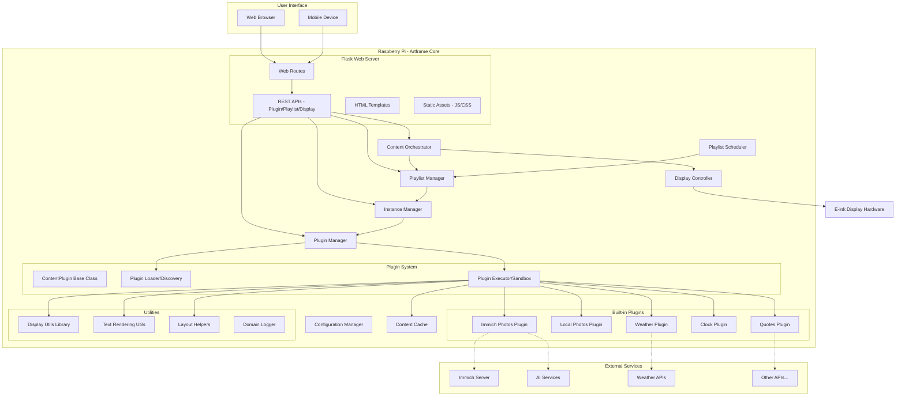
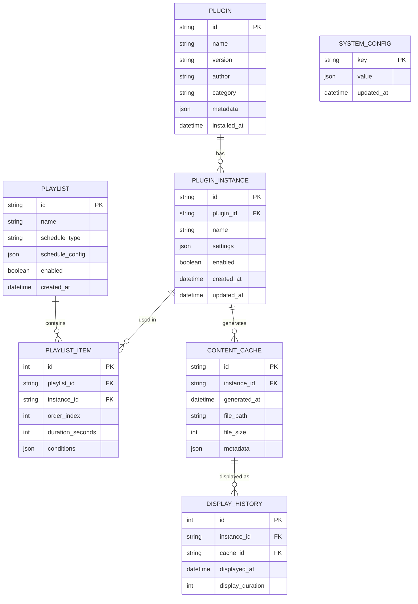
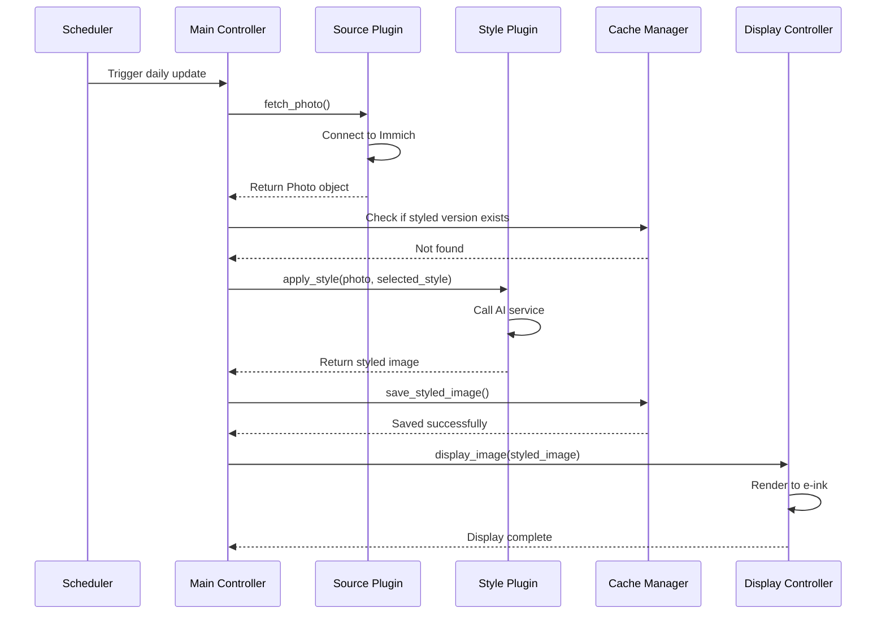

# Artframe - Technical Specification Document
*Version 3.0 - Plugin Architecture*

---

## 1. Project Overview

### Purpose
Artframe is a Raspberry Pi-based e-ink content display platform with a flexible plugin architecture. It enables users to display any type of content—photos, art, dashboards, information widgets, or custom visualizations—on e-ink displays through a unified web interface. Plugins can fetch content from any source, transform it as needed, and render optimized images for e-ink displays. The system is managed entirely through a web dashboard, eliminating the need for SSH access or command-line interaction.

### Design Philosophy
Artframe follows the **"display anything via plugins"** philosophy. Rather than being a single-purpose photo frame, Artframe provides:
- **Extensible Plugin System** - Anyone can create plugins for new content types
- **Playlist Management** - Rotate between multiple content sources on flexible schedules
- **Instance-Based Configuration** - Run multiple instances of the same plugin with different settings
- **Universal Display Pipeline** - Common display optimization for all content types
- **Developer-Friendly API** - Simple plugin interface for rapid development

### Scope
The project encompasses:
- **Plugin Architecture** - Extensible system for content generation plugins
- **Web Dashboard Interface** - Complete system management via browser
- **Playlist System** - Schedule and rotate between content sources
- **Instance Management** - Multiple configurations per plugin type
- **E-ink Display Management** - Unified display pipeline with optimization
- **Form-based Configuration** - Dynamic settings UI per plugin
- **Real-time Monitoring** - System health, plugin status, display metrics
- **Content Caching** - Efficient storage and retrieval of generated content

### Built-in Plugin Types
**Content Plugins (shipped with Artframe):**
- **Immich Photos** - Display photos from Immich server with optional AI style transformation
- **Local Photos** - Slideshow from local filesystem directories
- **Weather Dashboard** - Current conditions and forecast visualization
- **Calendar View** - Daily agenda from calendar sources
- **Clock/Date** - Customizable time and date displays
- **RSS/News** - Headlines and summaries from feeds
- **Quotes** - Daily inspirational or custom quote rotation
- **System Stats** - Raspberry Pi monitoring dashboard

### Stakeholders
| Stakeholder | Role | Interest |
|------------|------|----------|
| Primary User | System owner/administrator | Display personalized content |
| Content Viewers | Family/visitors | Enjoying displayed content |
| Plugin Developers | Community contributors | Creating new content types |
| System Maintainer | Developer | Core platform updates |

### Assumptions & Constraints
**Assumptions:**
- Raspberry Pi has stable internet connectivity (for network-based plugins)
- Plugin dependencies are manageable within Pi resource limits
- E-ink display driver is functional and compatible
- Users have basic technical knowledge for initial setup

**Constraints:**
- Limited processing power of Raspberry Pi
- E-ink display refresh rate limitations (minimize updates)
- API rate limits from external services (varies by plugin)
- Storage capacity on Raspberry Pi SD card
- Plugin execution time should be < 2 minutes

## 2. Functional Requirements

### User Stories / Use Cases

| ID | User Story | Acceptance Criteria | Priority |
|----|------------|-------------------|----------|
| US-01 | As a user, I want to manage the frame entirely through a web interface | Can access dashboard via browser, no SSH needed | MUST |
| US-02 | As a user, I want to browse and install content plugins | Can view plugin gallery, read descriptions, install plugins | MUST |
| US-03 | As a user, I want to create multiple instances of the same plugin | Can run same plugin with different configurations (e.g., two photo albums) | MUST |
| US-04 | As a user, I want to create playlists that rotate between content | Can sequence content with custom timing and order | MUST |
| US-05 | As a user, I want each plugin to have its own settings form | Plugin-specific settings appear dynamically in web UI | MUST |
| US-06 | As a user, I want to preview content before displaying | Can test-run plugins and see output without affecting display | SHOULD |
| US-07 | As a user, I want real-time monitoring of system health | Can view CPU, memory, temperature, plugin status, display metrics | SHOULD |
| US-08 | As a user, I want manual control over display updates | Can trigger immediate refresh or pause playlist | MUST |
| US-09 | As a user, I want to view system and plugin logs | Can browse and filter logs via web interface | SHOULD |
| US-10 | As a developer, I want to create custom plugins easily | Can implement ContentPlugin interface and deploy | MUST |
| US-11 | As a developer, I want to test plugins independently | Can run plugin in test mode with mock display | SHOULD |
| US-12 | As a user, I want to share plugin configurations | Can export/import plugin instance settings | COULD |
| US-13 | As a user, I want content to adapt to my display dimensions | Plugins automatically optimize for configured display size | MUST |

### Core Features

1. **Plugin System Architecture**
   - Abstract base class for all content plugins
   - Automatic plugin discovery and registration
   - Dependency management per plugin
   - Isolated plugin execution environments
   - Plugin lifecycle hooks (init, execute, cleanup)
   - Settings schema validation per plugin
   - Plugin metadata (name, author, version, category)

2. **Web Dashboard Interface**
   - Multi-page navigation (Dashboard, Plugins, Playlists, Display, System)
   - Plugin gallery with search and categories
   - Instance management (create, edit, delete, duplicate)
   - Playlist builder with drag-and-drop
   - Real-time system monitoring with 1-second polling
   - Live content preview window
   - Interactive controls for scheduler and manual operations

3. **Playlist Management**
   - Create named playlists
   - Add plugin instances to playlists
   - Configure display duration per item
   - Set schedule per playlist (time-based, always-on)
   - Sequential or random playback modes
   - Conditional display rules (e.g., weather only in morning)

4. **Instance Management**
   - Multiple instances per plugin type
   - Named instances for easy identification
   - Per-instance settings persistence
   - Clone/duplicate instance configurations
   - Test mode for individual instances

5. **Display Management**
   - Real-time e-ink health monitoring
   - Aspect ratio detection and optimization
   - Universal image optimization pipeline
   - Power-efficient refresh cycles with burn-in prevention
   - Display driver abstraction (support multiple e-ink models)
   - Mock display mode for development

6. **Plugin Development Kit**
   - ContentPlugin base class
   - Display utilities library (aspect ratio, text rendering, layout helpers)
   - Settings schema definition framework
   - Test harness for plugin development
   - Example plugins with documentation
   - CLI tool for plugin scaffolding

### Edge Cases

| Scenario | Handling Strategy |
|----------|------------------|
| Plugin execution timeout | Kill plugin process, skip to next in playlist, log error |
| Plugin crashes during execution | Catch exception, display error image, continue playlist |
| Network connectivity loss | Display cached content, retry plugin on next cycle |
| Plugin dependency missing | Show error in plugin status, prevent instance creation |
| Invalid plugin configuration | Validate on save, prevent execution until fixed |
| Display driver crash | Automatic restart with systemd, reload last content |
| All playlist items fail | Display fallback error screen, alert via log |
| Corrupted plugin code | Disable plugin automatically, alert in dashboard |
| Conflicting plugin dependencies | Isolate plugins, document conflicts in plugin metadata |
| Out of disk space | Auto-purge old cache, alert user, reduce cache limits |

## 3. Non-Functional Requirements

### Performance
- Plugin execution: < 120 seconds (timeout)
- Content rendering: < 5 seconds
- Display refresh: < 2 seconds
- Web UI response time: < 200ms
- Memory usage per plugin: < 256MB
- Total system memory: < 512MB
- CPU usage: < 50% sustained
- Playlist transition: < 3 seconds

### Security
- Secure credential storage per plugin instance
- HTTPS for all external communications
- Input validation for all plugin settings and web forms
- Plugin sandboxing (limited filesystem access)
- Web server only accessible on local network (default: localhost:8000)
- CSRF protection for web forms
- Regular security updates via apt
- No authentication required (local network access assumed secure)
- Plugin code review recommendations for community plugins

### Scalability
- Support 50+ plugin instances across system
- Support 20+ active plugins simultaneously
- Queue system for plugin execution
- Efficient caching mechanism for generated content
- Configurable retention period for cached content
- Multiple playlists running on schedules

### Maintainability
- Modular plugin architecture with clear interface
- Plugin versioning and compatibility checking
- Comprehensive logging system per plugin
- Unit test coverage > 70% for core system
- Plugin test harness for developers
- Clear documentation and inline comments
- Version control with Git
- Automated update mechanism for plugins

### Compliance
- Respect external API access permissions
- Comply with third-party service terms of service
- GDPR considerations for personal data (local storage only)
- Plugin license compatibility checking
- Attribution requirements for plugins

## 4. System Architecture

### High-Level Architecture Diagram



### Components & Responsibilities

| Component | Responsibility | Key Classes/Modules |
|-----------|---------------|-------------------|
| **Core System** |
| Flask Web Server | Web dashboard and REST APIs | `app.py`, `routes.py`, templates |
| Content Orchestrator | Coordinates playlist execution and display updates | `ContentOrchestrator` |
| Plugin Manager | Discovery, loading, validation of plugins | `PluginManager` |
| Playlist Manager | Manages playlists, sequences, scheduling | `PlaylistManager` |
| Instance Manager | Manages plugin instance configs and lifecycle | `InstanceManager` |
| Configuration Manager | System and per-instance settings persistence | `ConfigManager` |
| Content Cache | Stores generated content for reuse | `ContentCache` |
| Display Controller | Hardware abstraction for e-ink displays | `DisplayController` |
| Playlist Scheduler | Time-based and event-based playlist triggers | `PlaylistScheduler` |
| **Plugin System** |
| ContentPlugin Base | Abstract base class for all plugins | `ContentPlugin` (ABC) |
| Plugin Loader | Discovers and imports plugin modules | `PluginLoader` |
| Plugin Executor | Sandboxed execution environment for plugins | `PluginExecutor` |
| **Built-in Plugins** |
| Immich Photos | Fetch photos from Immich with optional AI styling | `ImmichPhotosPlugin` |
| Local Photos | Display from local filesystem directories | `LocalPhotosPlugin` |
| Weather Dashboard | Weather visualizations from APIs | `WeatherPlugin` |
| Clock/Date | Time and date displays | `ClockPlugin` |
| Quotes | Daily quote rotation | `QuotesPlugin` |
| **Utilities** |
| Display Utils | Aspect ratio, scaling, optimization | `display_utils.py` |
| Text Rendering | Font rendering, text layout | `text_render.py` |
| Layout Helpers | Grid, flex, positioning utilities | `layout_utils.py` |
| Domain Logger | Per-plugin logging with context | `logger.py` |

### Data Flow

1. **Plugin Discovery & Registration Flow:**
   - System startup triggers plugin discovery
   - Plugin Loader scans plugin directories
   - Each plugin's metadata and settings schema loaded
   - Plugins registered in Plugin Manager
   - Web UI updated with available plugins

2. **Instance Creation Flow:**
   - User selects plugin from web UI
   - User fills plugin-specific settings form
   - Settings validated against plugin schema
   - Instance Manager creates named instance with config
   - Instance appears in available content sources

3. **Playlist Execution Flow:**
   - Scheduler triggers playlist at scheduled time
   - Playlist Manager retrieves next item (plugin instance)
   - Instance Manager loads instance configuration
   - Plugin Executor runs plugin with settings and device config
   - Plugin generates PIL.Image content
   - Content cached by Content Cache
   - Display Controller optimizes and renders to e-ink
   - Scheduler waits for configured duration, then repeats

4. **Manual Content Update Flow:**
   - User clicks "Refresh" in web UI
   - API calls Orchestrator to generate new content
   - Orchestrator executes current playlist item immediately
   - Result displayed on e-ink
   - Playlist timer resets

5. **Real-time Monitoring Flow:**
   - JavaScript polls system APIs every 1-3 seconds
   - APIs return: system stats, plugin status, playlist state, display metrics
   - DOM updated with current values
   - Plugin execution progress shown in real-time

## 5. Data Models & Storage

### ER Diagram



### Data Structures

```python
# Plugin system models
@dataclass
class PluginMetadata:
    id: str
    name: str
    version: str
    author: str
    description: str
    category: str
    dependencies: List[str]
    settings_schema: Dict[str, Any]

@dataclass
class PluginInstance:
    id: str
    plugin_id: str
    name: str
    settings: Dict[str, Any]
    enabled: bool
    created_at: datetime
    updated_at: datetime

@dataclass
class Playlist:
    id: str
    name: str
    schedule_type: str  # 'always', 'time', 'cron'
    schedule_config: Dict[str, Any]
    items: List['PlaylistItem']
    enabled: bool

@dataclass
class PlaylistItem:
    instance_id: str
    order: int
    duration_seconds: int
    conditions: Optional[Dict[str, Any]] = None

@dataclass
class ContentCache:
    id: str
    instance_id: str
    generated_at: datetime
    file_path: Path
    metadata: Dict[str, Any]

@dataclass
class DisplayState:
    current_instance_id: str
    current_playlist_id: str
    last_refresh: datetime
    next_scheduled: datetime
    error_count: int
```

### Core APIs

| Method | Description | Return Type |
|--------|-------------|-------------|
| **Plugin Management** |
| `discover_plugins()` | Scans and loads available plugins | `List[PluginMetadata]` |
| `get_plugin(plugin_id)` | Retrieves plugin by ID | `PluginMetadata` |
| `validate_plugin(plugin_id)` | Checks plugin dependencies and validity | `Tuple[bool, List[str]]` |
| **Instance Management** |
| `create_instance(plugin_id, name, settings)` | Creates plugin instance | `PluginInstance` |
| `update_instance(instance_id, settings)` | Updates instance settings | `bool` |
| `delete_instance(instance_id)` | Removes instance | `bool` |
| `list_instances(plugin_id=None)` | Lists instances, optionally filtered | `List[PluginInstance]` |
| **Playlist Management** |
| `create_playlist(name, schedule)` | Creates new playlist | `Playlist` |
| `add_to_playlist(playlist_id, instance_id, duration)` | Adds item to playlist | `bool` |
| `execute_playlist_item(item)` | Executes single playlist item | `PIL.Image` |
| **Content Management** |
| `get_cached_content(instance_id)` | Retrieves cached content | `Optional[ContentCache]` |
| `save_content(instance_id, image, metadata)` | Caches generated content | `ContentCache` |
| `purge_old_cache(days)` | Removes old cached content | `int` |

## 6. Design Patterns & Principles

### Relevant Design Patterns

1. **Plugin Pattern (Core Architecture)**
   - **Purpose:** Enable extensible content generation system
   - **Implementation:** Abstract base class with discovery and loading
   ```python
   class ContentPlugin(ABC):
       @abstractmethod
       def generate_image(self, settings: Dict, device_config: Dict) -> PIL.Image:
           """Generate content image for display"""
           pass

       @abstractmethod
       def validate_settings(self, settings: Dict) -> Tuple[bool, str]:
           """Validate plugin settings"""
           pass

       @property
       @abstractmethod
       def metadata(self) -> PluginMetadata:
           """Return plugin metadata"""
           pass
   ```

2. **Factory Pattern**
   - **Purpose:** Create plugin instances dynamically
   - **Implementation:** Plugin factory based on plugin ID
   ```python
   class PluginFactory:
       def create_instance(self, plugin_id: str, settings: Dict) -> ContentPlugin:
           plugin_class = self._registry[plugin_id]
           return plugin_class(settings)
   ```

3. **Strategy Pattern**
   - **Purpose:** Different playlist execution strategies
   - **Implementation:** Pluggable playlist execution modes (sequential, random, conditional)

4. **Observer Pattern**
   - **Purpose:** React to configuration and state changes
   - **Implementation:** Event system for config updates, playlist changes

2. **Observer Pattern**
   - **Purpose:** React to configuration changes
   - **Implementation:** Event system for config updates
   ```python
   class ConfigObserver:
       def on_config_change(self, key: str, value: Any):
           pass
   ```

3. **Repository Pattern**
   - **Purpose:** Abstract data storage operations
   - **Implementation:** Repository classes for each entity type

4. **Singleton Pattern**
   - **Purpose:** Single instance of display controller
   - **Implementation:** Module-level instance management

### Justification for Patterns Chosen
- **Plugin Pattern:** Essential for requirement of swappable services
- **Observer Pattern:** Enables reactive configuration updates
- **Repository Pattern:** Decouples business logic from storage
- **Singleton Pattern:** Hardware constraint (single display)

### Error Handling & Logging Strategy

```python
# Logging configuration
LOGGING_CONFIG = {
    'version': 1,
    'handlers': {
        'file': {
            'class': 'logging.handlers.RotatingFileHandler',
            'filename': '/var/log/artframe/artframe.log',
            'maxBytes': 10485760,  # 10MB
            'backupCount': 5
        },
        'console': {
            'class': 'logging.StreamHandler',
            'level': 'INFO'
        }
    },
    'root': {
        'level': 'DEBUG',
        'handlers': ['file', 'console']
    }
}

# Error handling hierarchy
class ArtframeError(Exception): pass
class SourceError(ArtframeError): pass
class StyleError(ArtframeError): pass
class DisplayError(ArtframeError): pass
```

## 7. APIs & Interfaces

### REST/GraphQL/gRPC Endpoints

While Artframe primarily consumes APIs, it exposes a minimal local REST API for management:

| Endpoint | Method | Description | Request | Response |
|----------|--------|-------------|---------|----------|
| `/api/status` | GET | System status | - | `{"status": "running", "last_update": "2024-01-01T12:00:00"}` |
| `/api/refresh` | POST | Trigger refresh | - | `{"success": true, "message": "Refresh initiated"}` |
| `/api/config` | GET | View configuration | - | Current configuration JSON |
| `/api/config` | PATCH | Update configuration | Partial config JSON | `{"success": true, "reloaded": true}` |
| `/api/cache/stats` | GET | Cache statistics | - | `{"total_images": 50, "size_mb": 245}` |

### Input/Output Data Formats

**Configuration File Format (YAML):**
```yaml
artframe:
  schedule:
    update_time: "06:00"  # Daily update time
    timezone: "America/New_York"
  
  source:
    provider: "immich"
    config:
      server_url: "https://immich.example.com"
      api_key: "${IMMICH_API_KEY}"  # Environment variable
      album_id: "family-photos"
      selection: "random"  # random, newest, oldest
  
  style:
    provider: "nanobanana"
    config:
      api_url: "https://api.nanobanana.com"
      api_key: "${NANOBANANA_API_KEY}"
      styles:
        - "ghibli"
        - "impressionist"
        - "watercolor"
        - "oil_painting"
        - "pencil_sketch"
      rotation: "daily"  # daily, random, sequential
  
  display:
    driver: "spectra6"
    config:
      gpio_pins:
        busy: 24
        reset: 17
        dc: 25
        cs: 8
      rotation: 0  # 0, 90, 180, 270
      show_metadata: true
  
  cache:
    directory: "/var/cache/artframe"
    max_images: 100
    max_size_mb: 500
    retention_days: 30
  
  logging:
    level: "INFO"
    file: "/var/log/artframe/artframe.log"
```

### External Integrations

**Immich API Integration:**
```python
class ImmichSource(SourcePlugin):
    endpoints = {
        'albums': '/api/album',
        'photos': '/api/asset',
        'random': '/api/asset/random'
    }
    
    def fetch_photo(self) -> Photo:
        # Implementation details
        pass
```

**NanoBanana API Integration:**
```python
class NanoBananaStyle(StylePlugin):
    endpoints = {
        'transform': '/v1/transform',
        'styles': '/v1/styles',
        'status': '/v1/job/{job_id}'
    }
    
    def apply_style(self, image: bytes, style: str) -> bytes:
        # Implementation details
        pass
```

## 8. Detailed Technical Workflows

### Sequence Diagrams

**Daily Update Workflow:**


### Key Algorithms / Pseudocode

**Style Selection Algorithm:**
```python
def select_style(config: Config, history: List[str]) -> str:
    """
    Select next style based on rotation strategy
    """
    strategy = config.style.rotation
    available_styles = config.style.styles
    
    if strategy == "random":
        return random.choice(available_styles)
    
    elif strategy == "sequential":
        if not history:
            return available_styles[0]
        last_index = available_styles.index(history[-1])
        next_index = (last_index + 1) % len(available_styles)
        return available_styles[next_index]
    
    elif strategy == "daily":
        # Use day of year for consistent daily rotation
        day_of_year = datetime.now().timetuple().tm_yday
        index = day_of_year % len(available_styles)
        return available_styles[index]
    
    else:
        return available_styles[0]  # Fallback
```

**Image Optimization for E-ink:**
```python
def optimize_for_eink(image: PIL.Image, display_size: Tuple[int, int]) -> PIL.Image:
    """
    Optimize image for e-ink display characteristics
    """
    # 1. Resize to display dimensions
    image = image.resize(display_size, PIL.Image.LANCZOS)
    
    # 2. Convert to grayscale if not already
    if image.mode != 'L':
        image = image.convert('L')
    
    # 3. Enhance contrast for e-ink
    enhancer = ImageEnhance.Contrast(image)
    image = enhancer.enhance(1.5)
    
    # 4. Apply dithering for better grayscale representation
    image = image.convert('1', dither=PIL.Image.FLOYDSTEINBERG)
    
    return image
```

## 9. Deployment & Infrastructure

### Environments

| Environment | Purpose | Configuration |
|------------|---------|---------------|
| Development | Local testing on desktop | Mock display, local services |
| Testing | Raspberry Pi testing | Real hardware, test services |
| Production | Daily operation | Full configuration, real services |

### CI/CD Pipeline

```yaml
# .github/workflows/artframe.yml
name: Artframe CI/CD

on:
  push:
    branches: [main, develop]
  pull_request:
    branches: [main]

jobs:
  test:
    runs-on: ubuntu-latest
    steps:
      - uses: actions/checkout@v2
      - name: Set up Python
        uses: actions/setup-python@v2
        with:
          python-version: 3.9
      - name: Install dependencies
        run: |
          pip install -r requirements.txt
          pip install pytest pytest-cov
      - name: Run tests
        run: pytest --cov=artframe tests/
      
  deploy:
    needs: test
    if: github.ref == 'refs/heads/main'
    runs-on: ubuntu-latest
    steps:
      - name: Deploy to Raspberry Pi
        uses: appleboy/ssh-action@master
        with:
          host: ${{ secrets.RPI_HOST }}
          username: ${{ secrets.RPI_USER }}
          key: ${{ secrets.RPI_SSH_KEY }}
          script: |
            cd /opt/artframe
            git pull origin main
            pip install -r requirements.txt
            sudo systemctl restart artframe
```

### Infrastructure-as-Code / Hosting / Cloud Details

**Raspberry Pi Setup Script:**
```bash
#!/bin/bash
# setup_artframe.sh

# System dependencies
sudo apt-get update
sudo apt-get install -y python3-pip python3-venv git libjpeg-dev zlib1g-dev

# Python environment
python3 -m venv /opt/artframe/venv
source /opt/artframe/venv/bin/activate
pip install --upgrade pip

# Install application
cd /opt/artframe
pip install -r requirements.txt

# Create systemd service
cat > /etc/systemd/system/artframe.service << EOF
[Unit]
Description=Artframe Digital Photo Frame
After=network.target

[Service]
Type=simple
User=pi
WorkingDirectory=/opt/artframe
Environment="PATH=/opt/artframe/venv/bin"
ExecStart=/opt/artframe/venv/bin/python main.py
Restart=always
RestartSec=10

[Install]
WantedBy=multi-user.target
EOF

# Enable and start service
sudo systemctl daemon-reload
sudo systemctl enable artframe
sudo systemctl start artframe
```

**Resource Requirements:**
- Raspberry Pi 3B+ or newer
- 8GB+ SD card
- Stable power supply (5V, 2.5A minimum)
- Network connectivity (WiFi or Ethernet)

## 10. Testing & Quality Assurance

### Unit, Integration, End-to-End Testing

**Test Strategy:**

| Test Type | Coverage | Tools | Focus Areas |
|-----------|----------|-------|-------------|
| Unit Tests | 85% | pytest, mock | Plugin interfaces, business logic |
| Integration Tests | 70% | pytest, docker | API interactions, cache operations |
| End-to-End Tests | Manual | Physical device | Complete workflows |
| Performance Tests | Key paths | pytest-benchmark | Image processing, API calls |

**Example Test Cases:**
```python
# tests/test_source_plugin.py
def test_immich_source_fetch():
    source = ImmichSource(config)
    photo = source.fetch_photo()
    assert photo is not None
    assert photo.source_url.startswith('https://')

# tests/test_style_plugin.py
@patch('requests.post')
def test_style_application(mock_post):
    mock_post.return_value.json.return_value = {'job_id': '123'}
    style = NanoBananaStyle(config)
    result = style.apply_style(image_bytes, 'ghibli')
    assert result is not None
```

### Load/Stress Testing

| Scenario | Target | Method |
|----------|--------|--------|
| Rapid refresh requests | 10 requests/minute | Locust script |
| Large image processing | 10MB images | Memory profiling |
| Network interruption | 24-hour resilience | Chaos engineering |
| Cache overflow | 500MB limit | Automated fill test |

### Test Data Strategy

```yaml
test_data:
  images:
    - small: 100KB JPEG files
    - medium: 1MB JPEG files  
    - large: 5MB JPEG files
    - corrupted: Intentionally damaged files
  
  mock_services:
    immich:
      - success_responses
      - error_responses
      - timeout_scenarios
    
    ai_service:
      - immediate_response
      - delayed_response
      - partial_failure
```

## 11. Risks & Mitigations

### Known Risks

| Risk | Impact | Probability | Mitigation Strategy |
|------|--------|-------------|-------------------|
| API service discontinuation | High | Medium | Plugin architecture for easy replacement |
| API rate limiting | Medium | High | Implement caching and request throttling |
| SD card corruption | High | Low | Regular backups, read-only filesystem |
| E-ink display degradation | Medium | Low | Minimize refresh cycles, gentle refresh |
| Network instability | Medium | Medium | Offline mode with cached images |
| Memory constraints | Medium | Medium | Image size limits, aggressive caching |

### Trade-offs Considered

| Decision | Trade-off | Rationale |
|----------|-----------|-----------|
| Python vs Go | Performance vs Development speed | E-ink driver availability in Python |
| Local vs Cloud processing | Privacy vs Resources | Family photos stay private |
| Daily vs Real-time updates | Freshness vs Display longevity | E-ink displays have limited refresh cycles |
| Plugin system complexity | Complexity vs Flexibility | Future-proofing is priority |

### Mitigation Strategies

1. **Service Reliability:**
   - Implement circuit breaker pattern
   - Multiple retry strategies with exponential backoff
   - Graceful degradation to cached/original images

2. **Data Integrity:**
   - Regular automated backups to external storage
   - Checksum validation for cached images
   - Configuration file versioning

3. **Performance Optimization:**
   - Lazy loading of images
   - Thumbnail generation for quick previews
   - Background processing for style transformations

## 12. Appendix

### Glossary

| Term | Definition |
|------|------------|
| E-ink | Electronic ink display technology with low power consumption |
| Immich | Self-hosted photo management solution |
| Style Transfer | AI technique to apply artistic styles to images |
| Plugin Architecture | Software design allowing modular extensions |
| GPIO | General Purpose Input/Output pins on Raspberry Pi |
| Dithering | Technique to create grayscale illusion with black/white pixels |

### References

- [Spectra 6 E-ink Display Documentation](https://example.com/spectra6-docs)
- [Immich API Documentation](https://immich.app/docs/api)
- [Raspberry Pi GPIO Documentation](https://www.raspberrypi.org/documentation/usage/gpio/)
- [Python Pillow Library](https://pillow.readthedocs.io/)
- [systemd Service Management](https://www.freedesktop.org/software/systemd/man/systemd.service.html)

### Future Enhancements

1. **Phase 2 Features:**
   - Web interface for remote management
   - Multi-frame slideshow mode
   - Weather/calendar overlay integration
   - Motion sensor for presence detection

2. **Phase 3 Features:**
   - Mobile app for configuration
   - Social media source integration
   - Custom style training
   - Multi-display support

3. **Long-term Considerations:**
   - Color e-ink display support
   - Voice command integration
   - AI-based photo curation
   - Distributed frame network for multiple rooms

---

*Document Version: 1.0*  
*Last Updated: 2024*  
*Author: System Architect*